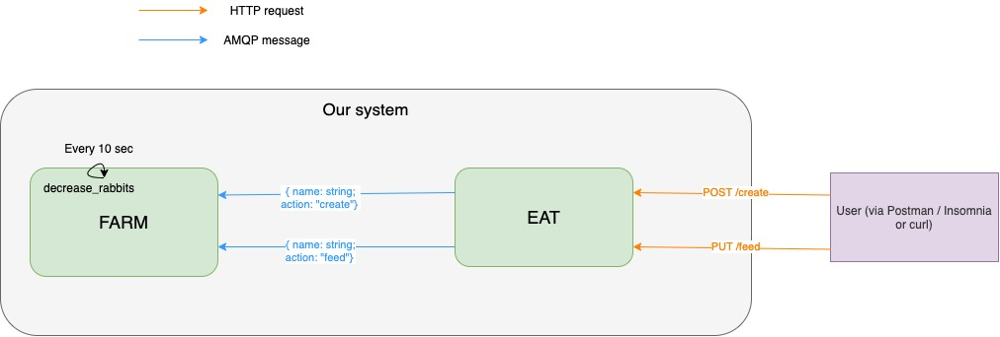

# Rabbit Kata


The objective of this kata is to manipulate the concepts of inter-process communication. We will see several types of IPC: timers, RPC REST calls and RPC calls via RabbitMQ.
In this kata, we'll talk about a rabbit farm. We will have a service that creates and feeds the rabbits and another service that manages the rabbit farm.

Here our system :


## Setup

```
esy install
esy build
```
To run binaries:
- `esy eat` to run eat binary
- `esy farm` to run farm binary

Each binary is a micro-service which expose a REST/JSON API for font-back communication and communicate back-to-back together through message queue.

For this training, we profide you most of plumbing code. Your work will focus on manipulating RPC with REST & Message Queue as long as doing the serialization/deserialisation of datas.

**Note: You have to uncomment some bits of code to make it work. This is indicated with the `(* TODO *)`**

At the end of this kata you should understand:
- What is a promise and how to use `Lwt` to manipulate them
- What is a message queue and how to use rabbitMQ to achieve RPC pattern with MQ.
- How to do REST/JSON API in OCaml with `dream` framework and `yojson` serialization/deserialization library

## Lwt


When we want to communicate between two different processes (two different servers for example), the execution is very often asynchronous. To be able to do asynchronous processing, we need structures that allow us to wait for a task to finish and to give us the return value of this task once it has finished (or to tell us that a task has failed and for what reason).

To do this in OCaml, we use a module called [Lwt](https://ocsigen.org/lwt/latest/api/Lwt).
Lwt is based on the notion of promises (like in Javascript).
A promise is a kind of container for a task that takes time to execute (i.e. asynchronous).
A promise has several states:
- `pending`: when the promise has not yet received its value (i.e. the task is not yet complete)
- `resolved`: when the promise has a value (i.e. the processing is complete and went well)
- `rejected`: when the task has failed, the promise is rejected and contains an error.


In the TP, to recover the value of a resolved promise, we will use [`Lwt.bind`](https://ocsigen.org/lwt/latest/api/Lwt#VALbind).

Actually `Lwt.bind` attaches callbacks to promises. When a promise gets a value, its callbacks are called.

> You may notice that Lwt.bind is `val bind: 'a t -> ('a -> 'b t) -> 'b t` where `t` is `Lwt.t`. That's the same signature as the well known `Result.bind` or `Option.bind`. That's because all are the monadic `bind` operation.

For more readability, we can redefine Lwt.bind with an operator:
```ocaml
module LwtSyntax = struct
  let ( let* ) = Lwt.bind
end
```

This syntactic sugar gives us a direct style syntax:
```ocaml
  let foo = Lwt.bind Lwt.return_unit (fun x -> Lwt.return x)
(* same as *)
  let foo_infix =
    let open Lwt in
    Lwt.return_unit >>= (fun x -> Lwt.return x)
(* same as *)
  let foo_let =
    let open LwtSyntax in
    let* x = Lwt.return_unit in
    Lwt.return x
```

So, to use it in a function, we can write:
```ocaml
let my_connection =
  let open LwtSyntax in
  let* connection = get_connection () in
  connection
```
A module can be opened locally with the syntax `let open MyModule in`.
Here, the connection variable will contain the return value of the `get_connection` promise when the connection is established.

## AMQP and RabbitMQ

AMQP means Advanced Message Queuing Protocol.
It is a protocol that allows communication between two instances by message. It is therefore an asynchronous communication.
There are `producers` who will publish messages on particular channels and `consumers` who will consume the messages on those channels, and then perform processing.

You can find all the concepts and keywords related to AMQP [here](https://www.rabbitmq.com/tutorials/amqp-concepts.html).

To sum up:
- communication takes place via `messages` sent by `producers`
- the way in which messages travel are called `queue`
- `messages` are consumed by `consumers`
- several types of architecture can be built as explained [here](https://www.rabbitmq.com/getstarted.html)

In this tutorial, [RPC communication](https://www.rabbitmq.com/tutorials/tutorial-six-python.html) pattern will be used.

### Exercice 0:

Create an account on RabbitMQ (https://www.cloudamqp.com/) and setup a free instance to get your credentials. Save it on variables `host` , `credentials` and `virtual_host` in `eat.ml` and `farm.ml`.

## Dream

To implements a REST server in OCaml, we will use [Dream](https://aantron.github.io/dream/).

Tip 💡: you can use `Dream.log` to log and debug your code.

## Specifications

We have two backends which correspond to two binaries:
- `eat` which corresponds to the API for creating and feeding a rabbit
- `farm` which manages the rabbit farm (creation and feeding)
These two backends communicate via RabbitMQ with an [RPC](https://www.rabbitmq.com/tutorials/tutorial-six-python.html) architecture


## Setup Dream

### Eat

[Dream](https://aantron.github.io/dream/) is setup with a logger and some routes:
- The dream application is started by [Dream.run](https://aantron.github.io/dream/#val-run)
- [Dream.logger](https://aantron.github.io/dream/#val-logger) is a middleware added to the web application to handle async logs. Those you will produce using [Dream.log](https://aantron.github.io/dream/#val-log)
- [Dream.router](https://aantron.github.io/dream/#val-router) that handle our routes
- Responses are in JSON encoding, using the [yojson](https://github.com/ocaml-community/yojson) librarie for serialization

> You may notice some type constructors like **`Assoc** those are [polymorphic variants](https://ocaml.org/manual/polyvariant.html). You may use them just as regular variant to produce values.

The goal is to add two routes:
- `POST /create` to create a rabbit
- `PUT /feed` to feed a rabbit

Both routes must accept a request with a JSON body containing the rabbit name like:
```json
{
  "name":"bugs bunny"
}
```
Also a logger seems to be nice to have.

### Exercice 1:

Run the server with `esy eat`.
Test the 3 routes with Postman, Insomnia or curl.

### Farm

We need just a server that runs on port 3000 with one route `GET /` that returns a JSON with the string "What's up doc ?".

### Exercice 2:

Write this server on `farm.ml` file.


## RabbitMQ setup

We need to setup a connection, a channel and a queue to RabbitMQ. Let's go.

### Exercice 3:
1. Write (in `farm.ml` and `eat.ml`) a function called `get_connection` with type `unit -> Connection.t Lwt.t` that make a connection on RabbitMQ service with your credentials.

2. Write (in `farm.ml` and `eat.ml`) a function called `get_channel` that takes a connection and return a channel.

3. Write (in `farm.ml` and `eat.ml`) a function called `get_queue` that takes a channel and return a queue.

4. In `eat.ml`, write a function called `run` that takes unit and setup connection,  channel and queue.

5. In `farm.ml`, write a function called `run` that takes a `handler` function and unit and setup connection, channel, queue and our rpc server. It must return `Queue.t * Channel.t Lwt.t` Handler will be implemented later.

6. In `eat.ml`, write a function called `request` that takes a key (i.e. function's name we want to execute in remote) and a rabbit's name and make a RPC call with `Rpc.Client.call`. This function must return a `'a Lwt.t`.
You can use the default exchange.
The routing key need to be the same as queue's name in `farm.ml`.
To make a message, use the module `Message`.
To encode/decode JSON, you can use module `Yojson.Safe`.

## Create a rabbit

Now we have setup Dream and RabbitMQ and we can write functions neeeded to create a rabbit.

### Eat

We need to write an handler to handle create HTTP request and a function to make an RPC call in order to create a rabbit.

### Exercice 4:

1. Write a `create_rabbit_rpc` to make a RPC call. You must use your previous request function.

2. Write an handler for your HTTP route. It should take the `request` as parameter.
You can use `from_request_to_name` to parse the body and get the rabbit's name.
You can return the data received by message from the farm.


### Farm

We need to implement the handler.

### Exercice 5:

Handler has several parameters:
- `farm` is the rabbits farm
- `m` is a [mutex](https://ocsigen.org/lwt/latest/api/Lwt_mutex) to lock the writing in Hashtabl

> mutex (for mutual exclusion) is a mechanism that enforces limits on access to a resource when there are many threads of execution. Since Hashtabl is a mutable structure we must be sure that when a light thread start to update the data, no other will do before the promise is resolved or rejected

- `(h, s)` is the message received where `h` is metadata and `s` the content.

1. Decode the content's message in `handler` function.
2. Write a `create_rabbit_handler` to add a new rabbit in farm if his name is not already present, else do nothing. You can return `unit Lwt.t`.
3. In `handler` function, call `create_rabbit_handler` in right action. (tip: see `Rabbit_Message` module in `rabbit_message.ml`)


You can test your code with Postman, Insomnia or curl to make sure everything works.


## Feed a rabbit

### Eat

### Exercice 6:

Do the same as for "Create a rabbit"

### Farm

### Exercice 7:

Do the same as for "Create a rabbit" except that in the `feed_rabbit_handler`, we want feed a rabbit:
- if rabbit is already in farm, increase its `feed_unit` by 1
- if rabbit is not present, add him and initialize his feed units with 5


## Decrease rabbit feed units

In farm, we want the rabbits to lose one feed unit every 10 seconds down to 0.

### Exercice 8:

1. Write a function that decrease feed units of all rabbits in the farm, according rules above.

2. Write a function that call the function at 1. every 10 sec. You can use the module `Lwt_timeout`.
Tip: you need to write a recrusive function to make that. Use keyword `rec`.


## Bonus

### Exercice 9:

In `farm.ml`, in your handlers to create and feed a rabbit, instead of return unit, return a rabbit to display it in eat service.


### Exercice 10:

We want to get all rabbits in farm every 10 seconds.

1. In `eat.ml`, write functions to get all rabbits every 10 sec = it should send an AMQP message every 10 sec to get rabbits.

2. In `farm.ml`, fill handler to send all rabbits through an AMQP message. You need to serialize the farm into JSON. `to_json` in `RabbitFarm` module can help.

3. In `eat.ml`, display rabbits received by message. You should deserialize them before display rabbits.


